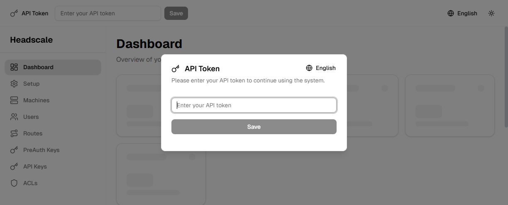

<div align="center">

# Headscale Dashboard


A modern, beautiful web dashboard for managing your Headscale VPN server.

**Built with**     

[🚀 Quick Start](#quick-start) • [📖 Documentation](#installation) • [🐛 Report Bug](https://github.com/QuocDuong16/headscale-dashboard/issues) • [💡 Request Feature](https://github.com/QuocDuong16/headscale-dashboard/issues)



</div>

## 📑 Table of Contents

- [✨ Features](#-features)
- [🚀 Quick Start](#-quick-start)
- [📦 Installation](#-installation)
- [⚙️ Configuration](#️-configuration)
- [🔧 Usage](#-usage)
- [🐛 Troubleshooting](#-troubleshooting)
- [🔄 Updating](#-updating)
- [🤝 Contributing](#-contributing)
- [📄 License](#-license)

## ✨ Features

- 🖥️ **Machine Management**: View, rename, move, expire, and delete machines
- 👥 **User Management**: Create, rename, and delete users
- 🛣️ **Route Management**: Enable, disable, and manage network routes
- 🔑 **API Keys**: Create and manage API keys for programmatic access
- 🔐 **PreAuth Keys**: Generate and manage pre-authentication keys
- 🛡️ **ACL Editor**: Configure Access Control Lists with a JSON editor
- 📊 **Dashboard**: Real-time overview of your network status
- 🎨 **Modern UI**: Beautiful interface with dark mode support
- 🔔 **Toast Notifications**: User-friendly feedback for all actions
- ⚡ **Real-time Updates**: Auto-refresh every 30 seconds

## Project Status

⚠️ **Early Development Stage**

This project is currently in active development. While the core functionality has been implemented, comprehensive testing is still in progress. Some features may have bugs or unexpected behavior.

**We encourage you to:**
- 🐛 **Report bugs**: If you encounter any issues, please [open an issue](https://github.com/QuocDuong16/headscale-dashboard/issues) with detailed information
- 💡 **Suggest improvements**: Your feedback and suggestions are highly valued
- 🔍 **Test thoroughly**: Help us improve by testing different scenarios and reporting your findings

We are committed to making this dashboard more stable and feature-complete in the future. Your contributions and bug reports are essential for this project's success!

## 🚀 Quick Start

Get up and running in seconds:

```bash
docker run -d \
  -p 3000:3000 \
  -e HEADSCALE_API_URL=https://your-headscale-server.com \
  --name headscale-dashboard \
  --restart unless-stopped \
  ghcr.io/quocduong16/headscale-dashboard:latest
```

Then open `http://localhost:3000` in your browser! 🎉

---

## 📦 Installation

### Requirements

- Docker (for Docker deployment)
- A running Headscale server with API access
- Headscale API token (get it from your Headscale server)

### Docker (Recommended)

The easiest way to run Headscale Dashboard is using Docker.

#### One-Line Install

```bash
docker run -d -p 3000:3000 -e HEADSCALE_API_URL=https://your-headscale-server.com --name headscale-dashboard --restart unless-stopped ghcr.io/quocduong16/headscale-dashboard:latest
```

**Replace:** `https://your-headscale-server.com` with your actual Headscale API URL

> 💡 **Tip:** To use a different port, add `-e PORT=8080` and change the port mapping to `-p 8080:8080`

#### Using Docker Compose

1. Create a `docker-compose.yml` file:

```yaml
version: '3.8'

services:
  headscale-dashboard:
    image: ghcr.io/quocduong16/headscale-dashboard:latest
    container_name: headscale-dashboard
    ports:
      - "3000:3000"
    environment:
      - HEADSCALE_API_URL=https://your-headscale-server.com
      - NODE_ENV=production
      # Optional: Override default port (default is 3000)
      # - PORT=8080
    restart: unless-stopped
```

**Note:** If you change the `PORT` environment variable, make sure to update the port mapping (e.g., `"8080:8080"` if `PORT=8080`).

2. Run:

```bash
docker-compose up -d
```

### TrueNAS Scale

1. Go to **Apps** → **Available Applications**
2. Click **Custom App**
3. Fill in the form:

   **Basic Configuration:**
   - Application Name: `headscale-dashboard`
   - Image Repository: `ghcr.io/quocduong16/headscale-dashboard`
   - Image Tag: `latest`
   - Container Port: `3000`
   - Protocol: `TCP`

   **Environment Variables:**
   - `HEADSCALE_API_URL`: Your Headscale API URL (e.g., `https://vpn.example.com`)
   - `NODE_ENV`: `production`
   - `PORT`: (Optional) Server port inside container (default: `3000`)
     - If you set a custom PORT, make sure to update Container Port and Node Port below

   **Networking:**
   - Port Forwarding:
     - Container Port: `3000` (or match your `PORT` environment variable)
     - Node Port: `3000` (or any available port)
     - Protocol: `TCP`

   **Health Check (optional):**
   - Enable: ✅
   - Type: `HTTP`
   - Path: `/api/health`
   - Port: `3000`

4. Click **Save** and wait for deployment

## 🔧 Usage

1. **Access the Dashboard**: Open `http://your-server-ip:3000` in your browser

2. **Enter API Token**: 
   - On first load, you'll see a token input field in the header
   - Enter your Headscale API token
   - The token is stored in your browser's local storage

3. **Navigate**: 
   - Use the sidebar to access different sections:
     - **Dashboard**: Overview of your network
     - **Machines**: Manage connected devices
     - **Users**: Manage users
     - **Routes**: Manage network routes
     - **API Keys**: Manage API keys
     - **PreAuth Keys**: Generate pre-authentication keys
     - **ACLs**: Configure Access Control Lists

4. **Manage Resources**: 
   - Use action buttons to perform operations
   - Click on machines to view detailed information
   - Use modals to create or edit resources

## ⚙️ Configuration

### Environment Variables

| Variable | Description | Required | Default |
|----------|-------------|----------|---------|
| `HEADSCALE_API_URL` | Headscale API server URL | Yes | - |
| `NODE_ENV` | Node environment | No | `production` |
| `PORT` | Server port (runtime variable, can be overridden) | No | `3000` |
| `HOSTNAME` | Server hostname (runtime variable, can be overridden) | No | `0.0.0.0` |

**Important Notes:**
- `PORT` and `HOSTNAME` are **runtime environment variables** - they are read when the container starts, not at build time
- You can override these values when running the container (e.g., `-e PORT=8080`)
- If you change `PORT`, make sure to update the Docker port mapping accordingly (e.g., `-p 8080:8080`)
- This works with pre-built images (like those used in TrueNAS) - you can set `PORT` via environment variables in the container runtime

### Getting Your Headscale API Token

1. SSH into your Headscale server
2. Run:
   ```bash
   headscale apikeys create -e 30d
   ```
3. Copy the generated API key
4. Use this key in the dashboard's token input field

## 🐛 Troubleshooting

### Container won't start
- Check logs: `docker logs headscale-dashboard`
- Verify `HEADSCALE_API_URL` is correct and accessible
- Ensure the port (default 3000) is not already in use
- If you set a custom `PORT`, verify the port mapping matches (e.g., if `PORT=8080`, use `-p 8080:8080`)

### Can't connect to Headscale API
- Verify `HEADSCALE_API_URL` is correct
- Check if your Headscale server is accessible from the container
- Ensure your Headscale server allows API connections
- Verify your API token is valid

### Dashboard shows errors
- Check browser console for errors
- Verify API token is correct
- Check network connectivity to Headscale server
- Review container logs for server-side errors

### Health check failing (TrueNAS)
- Verify `/api/health` endpoint is accessible
- Check container logs for errors
- Ensure port forwarding is configured correctly

## 🔄 Updating

### Docker

```bash
docker pull ghcr.io/quocduong16/headscale-dashboard:latest
docker stop headscale-dashboard
docker rm headscale-dashboard
docker run -d \
  -p 3000:3000 \
  -e HEADSCALE_API_URL=https://your-headscale-server.com \
  --name headscale-dashboard \
  --restart unless-stopped \
  ghcr.io/quocduong16/headscale-dashboard:latest
```

### TrueNAS Scale

1. Go to the app in TrueNAS
2. Click **Upgrade**
3. Select the new image tag
4. Click **Upgrade**

## 🤝 Contributing

Contributions are welcome and greatly appreciated! 

### How to Contribute

1. 🍴 Fork the repository
2. 🌿 Create a feature branch (`git checkout -b feature/amazing-feature`)
3. 💾 Commit your changes (`git commit -m 'Add some amazing feature'`)
4. 📤 Push to the branch (`git push origin feature/amazing-feature`)
5. 🔀 Open a Pull Request

### What You Can Do

- 🐛 **Report bugs** by opening an issue
- 💡 **Suggest new features** or improvements
- 🔧 **Submit pull requests** for bug fixes or enhancements
- 📝 **Improve documentation** (typos, clarifications, examples)
- 🎨 **Enhance UI/UX** (design improvements, accessibility)
- 🌍 **Add translations** (i18n support)

### Development Setup

```bash
# Clone the repository
git clone https://github.com/QuocDuong16/headscale-dashboard.git
cd headscale-dashboard

# Install dependencies
pnpm install

# Run development server
pnpm dev
```

---

## 📄 License

This project is open source and available under the [MIT License](LICENSE).

---

<div align="center">

**Made with ❤️ by [QuocDuong16](https://github.com/QuocDuong16)**

⭐ Star this repo if you find it helpful!

[⬆ Back to Top](#headscale-dashboard)

</div>
